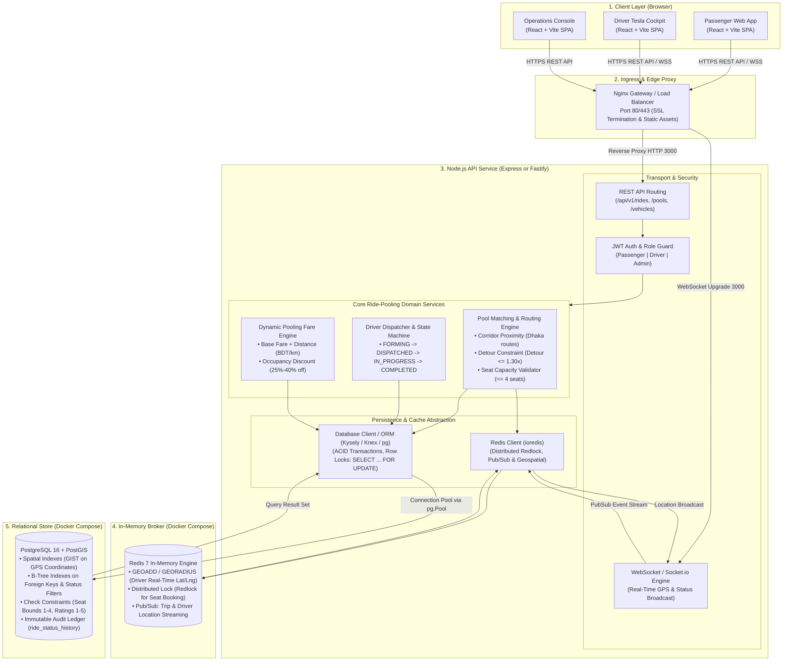
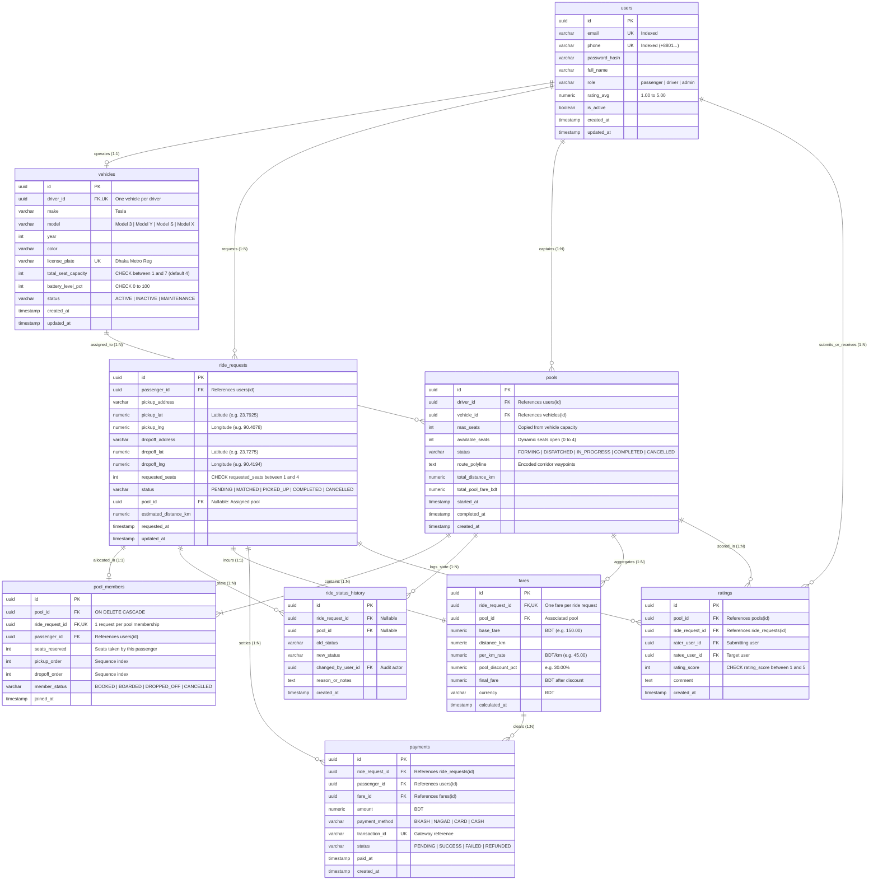

# Dhaka Tesla Pool - System Architecture & Database Design

This document details the system architecture, component data flows, entity-relationship diagrams, relationship definitions, and database constraints for the **Dhaka Tesla Pool MVP**.

---

## 1. System Overview & Core Actors

The platform coordinates ride-pooling operations across high-density urban transit corridors in Dhaka (e.g., Uttara ⇄ Airport ⇄ Banani ⇄ Gulshan ⇄ Motijheel). The MVP is modeled around **3 primary actors**:

1. **Passenger:** Creates ride requests specifying pickup/dropoff coordinates and requested seat count (1–4 seats), receives dynamic pooling discounts (25%–40%), and tracks Tesla arrival.
2. **Driver (with Tesla Vehicle):** Operates a registered electric vehicle (Tesla Model 3 / Model Y / Model S / Model X) with strict physical seat capacity constraints (typically 4 passenger seats), executing multi-stop passenger pickups and dropoffs.
3. **Ride / Pool:** The orchestrator and state machine grouping 1 to N passenger requests into a shared vehicle journey along overlapping route corridors, managing seat inventory atomically and preventing cabin overbooking.

---

## 2. Component Architecture Diagram (Mermaid)

The system leverages a 4-tier modern stack: **Client Browser (React Vite SPA) → Ingress Proxy (Nginx) → Node.js API Service (Fastify or Express) → Redis 7 Broker + PostgreSQL 16 Relational Store**.



### Component Roles & Responsibilities

- **React Vite Frontend:** Lightweight single-page app serving responsive passenger booking interfaces, Tesla cockpit navigation manifests, and administrative fleet monitors.
- **Node.js API (Fastify / Express):** High-throughput asynchronous runtime handling JWT authentication, REST endpoints, WebSocket streams, and corridor matching algorithms.
- **Redis 7 Broker:** In-memory store providing sub-millisecond driver geospatial indexing (`GEOADD`/`GEORADIUS`), trip status pub/sub distribution, and distributed lock coordination.
- **PostgreSQL 16 Relational Engine:** Primary persistent system of record providing strict ACID transactional guarantees, row-level concurrency locks (`SELECT ... FOR UPDATE`), check constraints, and foreign key cascades.

---

## 3. Entity-Relationship Diagram (ERD in Mermaid)



---

## 4. Relationship Explanations (1–2 Lines Each)

1. **`users (Driver)` → `vehicles` (One-to-One):**  
   Each active driver operates exactly one registered Tesla vehicle, ensuring verifiable ownership, license accreditation, and strict physical capacity bounds.

2. **`users (Passenger)` → `ride_requests` (One-to-Many):**  
   A passenger creates multiple trip requests over time across Dhaka, with business logic restricting them to at most one active (`PENDING` / `MATCHED` / `PICKED_UP`) booking at once.

3. **`users (Driver)` → `pools` (One-to-Many):**  
   A driver completes many pooled journeys sequentially throughout their shift, while only one pool can be concurrently active (`FORMING`, `DISPATCHED`, or `IN_PROGRESS`).

4. **`vehicles` → `pools` (One-to-Many):**  
   A Tesla vehicle is assigned to many pool trips over its lifetime, establishing the physical passenger seat ceiling (`max_seats = 4` for Tesla Model 3/Y).

5. **`pools` → `pool_members` (One-to-Many):**  
   A pool aggregates 1 to N passenger memberships sharing the vehicle cabin, specifying each passenger's seat reservation count, boarding order, and dropoff stop sequence.

6. **`ride_requests` → `pool_members` (One-to-One):**  
   An accepted passenger ride request maps to exactly one pool membership; the `UNIQUE(ride_request_id)` constraint prevents dual booking across competing pools.

7. **`ride_requests` / `pools` → `ride_status_history` (One-to-Many):**  
   Every state transition (e.g., `FORMING` → `DISPATCHED`, `PENDING` → `MATCHED`) is immutably recorded with actor metadata for auditing, SLA analysis, and compliance.

8. **`ride_requests` → `fares` (One-to-One):**  
   Each passenger receives an individual billing calculation applying a transparent pooling incentive discount (25%–40% off base + per-km rates) for sharing their Tesla ride.

9. **`fares` → `payments` (One-to-Many):**  
   A calculated fare is settled through local payment rails (bKash, Nagad, Card, or Cash), with one-to-many cardinality handling transaction retries, gateway timeouts, and partial refunds.

10. **`ride_requests` / `pools` → `ratings` (One-to-Many):**  
    A mutual review system where passengers rate driver service and vehicle cleanliness, and drivers rate passenger punctuality (1–5 stars with comments).

---

## 5. Concurrency Control, Ride Lifecycle State Machine & Matching Rule

### 5.1 Explicit Ride Lifecycle State Machine
The system strictly enforces the ride request lifecycle through an immutable state machine rather than arbitrary free-text updates. Any transition not explicitly listed in the transition table below is immediately rejected with `400 Bad Request` and an `INVALID_STATE_TRANSITION` error code:

| Current Status | Allowed Target Statuses | Rejection Behavior |
| :--- | :--- | :--- |
| **`REQUESTED`** | `MATCHED`, `ACCEPTED`, `CANCELLED` | Rejects `DRIVER_ARRIVED`, `STARTED`, `COMPLETED` |
| **`MATCHED`** | `ACCEPTED`, `DRIVER_ARRIVED`, `CANCELLED` | Rejects `REQUESTED`, `STARTED`, `COMPLETED` |
| **`ACCEPTED`** | `DRIVER_ARRIVED`, `CANCELLED` | Rejects `REQUESTED`, `MATCHED`, `COMPLETED` |
| **`DRIVER_ARRIVED`** | `STARTED`, `CANCELLED` | Rejects `REQUESTED`, `MATCHED`, `ACCEPTED` |
| **`STARTED`** | `COMPLETED`, `CANCELLED` | Rejects `REQUESTED`, `MATCHED`, `DRIVER_ARRIVED` |
| **`COMPLETED`** | *None (Terminal State)* | Rejects any subsequent transition |
| **`CANCELLED`** | *None (Terminal State)* | Rejects any subsequent transition; frees pool seats |

Every state transition writes an immutable audit record to `ride_status_history` storing `(old_status, new_status, actor_id, actor_role, timestamp, reason)`.

### 5.2 Corridor Pool Matching Function & Compatibility Rule
Given a new ride request $R$ and a candidate pool $P$ with assigned vehicle $V$:

1. **Strict Seat Availability:**  
   $$\text{requested\_seats} \le P.\text{available\_seats} \quad \text{AND} \quad \sum \text{reserved\_seats} + \text{requested\_seats} \le V.\text{seat\_capacity}$$
2. **Lifecycle State:**  
   Pool $P$ must be in `FORMING` or `MATCHED` state (pools in `DISPATCHED`, `IN_PROGRESS`, or `COMPLETED` cannot accept new riders).
3. **Pickup Cluster Proximity:**  
   $R$'s pickup zone must belong to the same arterial geographic cluster (e.g., North Dhaka: Gulshan, Banani, Uttara) or lie within a maximum detour threshold ($\le 1.5\text{ km}$) of existing corridor waypoints.
4. **Directional Vector Alignment:**  
   The bearing vector from pickup to dropoff $(\vec{d}_{R})$ must match the pool's route direction ($\vec{d}_{P}$) within an angular tolerance of $\pm 45^\circ$ (e.g., both Southbound along the Dhaka-Mymensingh / Pragati Sarani corridor).
5. **Maximum Detour Factor:**  
   Inserting the new pickup and dropoff must not increase total pool journey distance by more than 30% ($\text{Detour Factor} \le 1.30\times$).

### 5.3 Database Transaction with Row-Level Locking (`SELECT ... FOR UPDATE`)
To guarantee that two passengers attempting to book the last available seat on a 4-seat Tesla Model 3 cannot both succeed simultaneously, the allocation executes inside an ACID database transaction using PostgreSQL row-level exclusive locks:

```sql
BEGIN TRANSACTION ISOLATION LEVEL READ COMMITTED;

-- 1. Exclusively lock the candidate pool row (blocks concurrent transactions on this pool)
SELECT id, vehicle_id, available_seats, seat_capacity, status 
FROM pools 
WHERE id = :pool_id AND status IN ('FORMING', 'MATCHED')
FOR UPDATE;

-- 2. Lock vehicle record to enforce strict physical cabin seat ceiling
SELECT id, total_seat_capacity
FROM vehicles
WHERE id = :vehicle_id
FOR SHARE;

-- 3. Calculate verified current reserved seats under active memberships
SELECT COALESCE(SUM(seats_reserved), 0) AS current_booked_seats
FROM pool_members
WHERE pool_id = :pool_id AND member_status != 'CANCELLED';

-- 4. Invariant Assertion (Executed under exclusive row lock):
-- IF (current_booked_seats + :requested_seats > :total_seat_capacity) OR (:requested_seats > :available_seats) THEN
--    ROLLBACK;
--    RAISE EXCEPTION 'SEAT_CAPACITY_EXCEEDED';

-- 5. Insert verified pool member
INSERT INTO pool_members (
    id, pool_id, ride_request_id, passenger_id, seats_reserved,
    pickup_zone, dropoff_zone, pickup_order, dropoff_order, member_status, joined_at
) VALUES (
    gen_random_uuid(), :pool_id, :request_id, :passenger_id, :requested_seats,
    :pickup_zone, :dropoff_zone, :pickup_order, :dropoff_order, 'BOOKED', NOW()
);

-- 6. Atomically decrement remaining pool seats
UPDATE pools 
SET available_seats = available_seats - :requested_seats,
    status = CASE WHEN available_seats - :requested_seats = 0 THEN 'MATCHED' ELSE status END,
    updated_at = NOW()
WHERE id = :pool_id;

-- 7. Advance ride request status via State Machine
UPDATE ride_requests 
SET status = 'MATCHED', pool_id = :pool_id, updated_at = NOW()
WHERE id = :request_id;

-- 8. Write immutable audit log
INSERT INTO ride_status_history (
    id, ride_request_id, pool_id, old_status, new_status, changed_by_user_id, reason_or_notes, created_at
) VALUES (
    gen_random_uuid(), :request_id, :pool_id, 'REQUESTED', 'MATCHED', :actor_id, 'Matched with exclusive row lock', NOW()
);

COMMIT;
```

If two concurrent requests attempt to reserve the final seat, the first transaction acquires the `FOR UPDATE` lock. The second transaction blocks until the first commits. When unblocked, the second transaction evaluates `available_seats = 0` and is safely rolled back with `409 Conflict: SEAT_CAPACITY_EXCEEDED`, completely eliminating double-booking race conditions.

### 5.4 Pure Fare Calculation Engine (Integer Paisa Arithmetic)

To eliminate floating-point precision loss and rounding divergence across client/server boundaries, all monetary values in Dhaka Tesla Pool are represented and calculated strictly as **integers in paisa** ($1\text{ BDT} = 100\text{ paisa}$).

#### Formula:
$$\text{distanceCharge} = \text{round}(\text{distanceKm} \times \text{ratePerKm})$$
$$\text{grossFare} = \text{baseFare} + \text{distanceCharge}$$
$$\text{poolDiscount} = \text{round}\left(\text{grossFare} \times \frac{\text{poolDiscountPercent}}{100}\right)$$
$$\text{passengerFare} = \text{grossFare} - \text{poolDiscount}$$

#### Worked Example: Nusrat & Rafiq Overlapping Trip (2+ Shared Riders)
- **Base Fare:** $3{,}000\text{ paisa}$ ($30.00\text{ BDT}$)
- **Rate per Km:** $2{,}500\text{ paisa/km}$ ($25.00\text{ BDT/km}$)
- **Pool Discount:** $20\%$ ($\text{poolDiscountPercent} = 20$) applied when $2+$ riders share an overlapping corridor pool.

| Metric | Rider 1: Nusrat | Rider 2: Rafiq |
| :--- | :--- | :--- |
| **Pickup $\to$ Dropoff** | Gulshan-2 $\to$ Motijheel | Banani 11 $\to$ Motijheel |
| **Trip Distance** | $10.0\text{ km}$ | $8.5\text{ km}$ |
| **Base Fare** | $3{,}000\text{ paisa}$ ($30\text{ BDT}$) | $3{,}000\text{ paisa}$ ($30\text{ BDT}$) |
| **Distance Charge** | $10.0 \times 2{,}500 = 25{,}000\text{ paisa}$ | $8.5 \times 2{,}500 = 21{,}250\text{ paisa}$ |
| **Gross Solo Fare** | $3{,}000 + 25{,}000 = 28{,}000\text{ paisa}$ ($280\text{ BDT}$) | $3{,}000 + 21{,}250 = 24{,}250\text{ paisa}$ ($242.50\text{ BDT}$) |
| **Pool Discount ($20\%$)** | $28{,}000 \times 0.20 = \mathbf{5{,}600\text{ paisa}}$ ($56\text{ BDT}$) | $24{,}250 \times 0.20 = \mathbf{4{,}850\text{ paisa}}$ ($48.50\text{ BDT}$) |
| **Final Passenger Fare** | $28{,}000 - 5{,}600 = \mathbf{22{,}400\text{ paisa}}$ ($\mathbf{224.00\text{ BDT}}$) | $24{,}250 - 4{,}850 = \mathbf{19{,}400\text{ paisa}}$ ($\mathbf{194.00\text{ BDT}}$) |

**Pool Economics Summary:**
- Combined Passenger Collections: $22{,}400 + 19{,}400 = 41{,}800\text{ paisa}$ ($418.00\text{ BDT}$).
- Revenue vs Single Solo Rider: $+49.3\%$ gross fare yield for driver/fleet.
- Rider Savings: Both Nusrat and Rafiq save exactly $20\%$ compared to private non-pooled rides.

---

## 6. Docker Compose Configuration

```yaml
version: '3.9'

services:
  postgres:
    image: postgres:16-alpine
    container_name: dhaka_tesla_postgres
    restart: unless-stopped
    environment:
      POSTGRES_USER: ${POSTGRES_USER:-dhaka_pool_user}
      POSTGRES_PASSWORD: ${POSTGRES_PASSWORD:-tesla_secret_pass_2026}
      POSTGRES_DB: ${POSTGRES_DB:-dhaka_tesla_pool_db}
    ports:
      - "5432:5432"
    volumes:
      - pgdata:/var/lib/postgresql/data
    healthcheck:
      test: ["CMD-SHELL", "pg_isready -U ${POSTGRES_USER:-dhaka_pool_user} -d ${POSTGRES_DB:-dhaka_tesla_pool_db}"]
      interval: 5s
      timeout: 5s
      retries: 5
    networks:
      - tesla_net

  redis:
    image: redis:7-alpine
    container_name: dhaka_tesla_redis
    restart: unless-stopped
    command: ["redis-server", "--appendonly", "yes", "--requirepass", "${REDIS_PASSWORD:-redis_tesla_secret}"]
    ports:
      - "6379:6379"
    volumes:
      - redisdata:/data
    healthcheck:
      test: ["CMD", "redis-cli", "-a", "${REDIS_PASSWORD:-redis_tesla_secret}", "ping"]
      interval: 5s
      timeout: 5s
      retries: 5
    networks:
      - tesla_net

  api:
    build:
      context: ./backend
      dockerfile: Dockerfile
    container_name: dhaka_tesla_api
    restart: unless-stopped
    environment:
      NODE_ENV: development
      PORT: 4000
      DATABASE_URL: postgres://${POSTGRES_USER:-dhaka_pool_user}:${POSTGRES_PASSWORD:-tesla_secret_pass_2026}@postgres:5432/${POSTGRES_DB:-dhaka_tesla_pool_db}
      REDIS_URL: redis://:${REDIS_PASSWORD:-redis_tesla_secret}@redis:6379
      JWT_SECRET: ${JWT_SECRET:-dhaka_tesla_jwt_super_secret_32chars_min}
      MAX_DETOUR_FACTOR: 1.30
      DEFAULT_TESLA_CAPACITY: 4
      BASE_FARE_BDT: 150.00
      PER_KM_RATE_BDT: 45.00
      POOL_DISCOUNT_PCT: 30.00
    ports:
      - "4000:4000"
    depends_on:
      postgres:
        condition: service_healthy
      redis:
        condition: service_healthy
    networks:
      - tesla_net

  web:
    build:
      context: ./frontend
      dockerfile: Dockerfile
    container_name: dhaka_tesla_web
    restart: unless-stopped
    environment:
      VITE_API_URL: http://localhost:4000
      VITE_WS_URL: ws://localhost:4000
    ports:
      - "3000:3000"
    depends_on:
      - api
    networks:
      - tesla_net

volumes:
  pgdata:
    driver: local
  redisdata:
    driver: local

networks:
  tesla_net:
    driver: bridge
```
